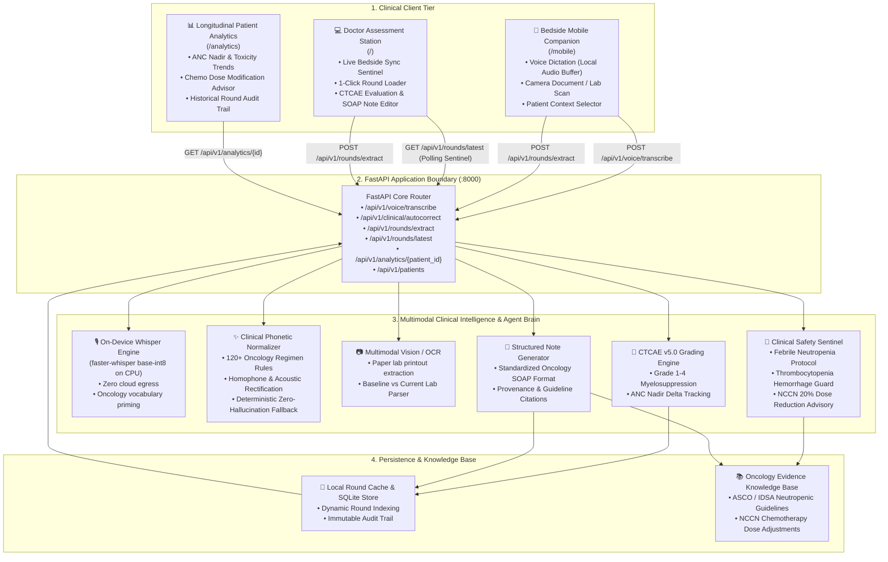
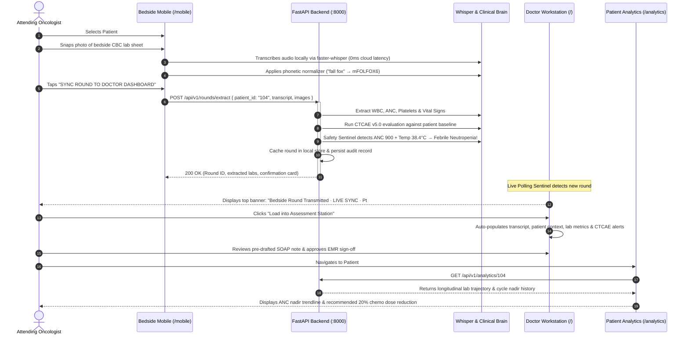

# 🩺 RoundsAI — Inpatient Oncology Round Intelligence

> **Turn a 20-minute inpatient oncology round into a structured, evidence-linked clinical note in under 2 minutes — with zero cloud audio privacy leakage and ₹0 API cost.**

[](https://fastapi.tiangolo.com)
[](https://nextjs.org)
[](https://www.typescriptlang.org)
[](https://www.python.org)
[](https://github.com/openai/whisper)
[](https://ai.google.dev)
[](LICENSE)

---

## 📋 Executive Overview

Inpatient oncology rounds are among the most cognitively demanding workflows in hospital medicine. Clinicians must simultaneously synthesize patient-reported symptoms, decipher printed laboratory sheets, calculate chemotherapy toxicity nadirs, and cross-reference clinical practice guidelines under extreme time constraints.

**RoundsAI** is a multimodal clinical intelligence copilot built specifically for the inpatient oncology ward:
- **Bedside Mobile Companion (`/mobile`)**: Oncologists dictate clinical observations on the move or scan bedside lab reports with their mobile camera.
- **Privacy-First On-Device Whisper AI**: Voice dictation is transcribed 100% locally on CPU via `faster-whisper` (base int8), ensuring **zero patient audio leaves the hospital firewall** with **₹0 cloud API fees**.
- **Specialized Oncology Normalizer**: A clinical phonetic engine corrects 120+ oncology acoustic homophones (*"fall fox"* $\rightarrow$ **mFOLFOX6**, *"anc nine hundred"* $\rightarrow$ **ANC 900 /µL**).
- **Instant Bedside-to-Desktop Synchronization**: 1-tap transmission immediately triggers a live sentinel banner on the desktop workstation with 1-click loading.
- **Automated CTCAE v5.0 Toxicity Grading**: Calculates baseline-to-current lab deltas and detects Grade 1–4 myelosuppression.
- **Active Safety Sentinels**: Instantly triggers emergency protocols (e.g., **Febrile Neutropenia** blood cultures and empiric antipseudomonal IV antibiotics within 60 minutes).
- **Longitudinal Patient Analytics (`/analytics`)**: Charts ANC/WBC/Platelet nadirs across chemotherapy cycles, predicts recovery windows, and recommends guideline-concordant dose modifications.
- **Hospital EMR Grade UI**: Clean, distraction-free interface built with Lucide-style vector SVG icons, tabular monospace lab typography, and strict 0-emoji compliance.

---

## 🏛️ System Architecture



---

## 🔄 End-to-End Clinical Round Flow



---

## ⚡ Key Features

### 1. High-Accuracy Voice & Zero-Cost Clinical Transcription
- **On-Device Whisper**: Employs `faster-whisper` (base int8) running locally on CPU. No external audio APIs, guaranteeing total HIPAA compliance and ₹0 per-minute billing.
- **120+ Specialized Oncology Regimens**: Normalizes acoustic homophones:
  - *Chemotherapy*: `"fall fox"` $\rightarrow$ `mFOLFOX6`, `"carbo taxol"` $\rightarrow$ `Carboplatin + Paclitaxel`, `"our chop"` $\rightarrow$ `R-CHOP`, `"fol fir inox"` $\rightarrow$ `FOLFIRINOX`.
  - *Lab Counts*: `"anc nine hundred"` $\rightarrow$ `ANC 900 /µL`, `"platelets one forty five k"` $\rightarrow$ `Platelets 145,000 /µL`.
  - *Clinical Terms*: `"a febrile"` $\rightarrow$ `afebrile`, `"sensory pare sthesia"` $\rightarrow$ `sensory paresthesia`.
- **Clinician Oversight Banner**: Displays automated diff notices with a 1-click **Undo** safeguard to revert any automatic text change.

### 2. Bedside-to-Desktop Live Synchronization
- Bedside mobile companion sends captured speech, photographs, and selected patient ID.
- Desktop workstation features an automatic background sentinel that detects newly transmitted bedside rounds.
- 1-click **"Load into Assessment Station"** transfers the complete clinical encounter to desktop without re-typing.

### 3. Automated CTCAE v5.0 & Clinical Safety Sentinels
- **Febrile Neutropenia Protocol**: Flags temperature $\ge 38.3^\circ\text{C}$ with $\text{ANC} < 1000$ /µL. Urgently prompts for blood cultures and empiric antipseudomonal IV antibiotics (*Cefepime 2g IV q8h*) within 60 minutes.
- **Myelosuppression Nadir Detection**: Computes baseline vs. current lab delta and classifies Grade 3 ($500 \le \text{ANC} < 1000$) and Grade 4 ($\text{ANC} < 500$) neutropenia.
- **Dose Modification Guidance**: Links nadir findings directly to NCCN guidelines, recommending a 20% dose reduction for subsequent cycles.

### 4. Longitudinal Patient Analytics
- Cycle-over-cycle laboratory trend charts for Absolute Neutrophil Count (ANC), White Blood Cells (WBC), and Platelets.
- Real-time toxicity trajectory and clinical recovery estimation.
- Historical ward round timeline with clinician sign-off timestamps and approved SOAP notes.

### 5. Hospital-Grade UI & Typography
- Strict **0-emoji design standard** with 22+ custom enterprise vector SVG icons.
- Tabular figures (`font-feature-settings: "tnum"`) for aligned clinical lab metrics.
- High-contrast clinical slate/navy color scheme.

---

## 🛠️ Technology Stack

| Layer | Technologies | Role |
| :--- | :--- | :--- |
| **Frontend** | Next.js 15 (App Router), React 19, TypeScript, Vanilla CSS | Doctor Workstation, Bedside Mobile Companion, Longitudinal Analytics |
| **Backend** | FastAPI, Python 3.12+, Uvicorn, Pydantic v2 | High-performance asynchronous REST API & clinical routing |
| **Local Speech AI** | `faster-whisper` (base int8), CTranslate2, Web Speech API | Offline, zero-cloud transcription on CPU |
| **Multimodal Vision** | Google Gemini 2.5 Flash SDK, Tesseract OCR | Multimodal lab sheet transcription & document analysis |
| **Clinical Logic** | CTCAE v5.0 Scoring Matrix, NCCN / ASCO Guidelines | Automated toxicity grading and safety sentinels |
| **Data & Storage** | In-memory cache, SQLite / PostgreSQL, Supabase integration | Longitudinal patient census & round audit logging |

---

## 🚀 Quickstart & Local Setup

### Prerequisites
- **Python**: 3.11 or higher
- **Node.js**: 18.x or higher (npm 9+)
- **Git**

### 1. Clone the Repository
```bash
git clone https://github.com/santhoshh005/Rounds_AI.git
cd Rounds_AI
```

### 2. Setup & Launch Backend
Open a terminal in the project root:

```powershell
# Create and activate Python virtual environment
py -m venv .venv
.\.venv\Scripts\Activate.ps1

# Install backend dependencies
pip install -r backend\requirements.txt

# Configure environment variables
Copy-Item .env.example .env

# Start FastAPI server
python -m uvicorn backend.api.main:app --host 0.0.0.0 --port 8000
```
*API health check available at [http://localhost:8000/health](http://localhost:8000/health) and Swagger documentation at [http://localhost:8000/docs](http://localhost:8000/docs).*

### 3. Setup & Launch Frontend
Open a second terminal in the `apps/web` directory:

```bash
cd apps/web
npm install
npm run dev
```
*Application available at [http://localhost:3000](http://localhost:3000).*

---

## 🌐 Application Routes

| Route | View | Description |
| :--- | :--- | :--- |
| `/` | **Doctor Assessment Station** | Desktop review station, live bedside sync banner, CTCAE grading, SOAP note editor |
| `/mobile` | **Bedside Mobile Companion** | Fast voice dictation, camera lab sheet capture, 1-tap dashboard sync |
| `/analytics` | **Patient Longitudinal Analytics** | Patient trajectory graphs, ANC nadir trends, cycle dose adjustment recommendations |
| `/login` | **Clinician Authentication** | Secure role-based staff authentication |

---

## 📁 Repository Structure

```text
├── apps/
│   └── web/
│       ├── app/
│       │   ├── components/
│       │   │   └── Icons.tsx           # Hospital-grade Lucide vector SVG icons
│       │   ├── mobile/page.tsx         # Bedside Mobile Capture Companion
│       │   ├── analytics/page.tsx      # Longitudinal Patient Analytics Dashboard
│       │   ├── login/page.tsx          # Clinician Authentication
│       │   ├── page.tsx                # Doctor Assessment Station & Sync Sentinel
│       │   ├── layout.tsx              # Root Layout & Clinical Navigation Shell
│       │   └── styles.css              # Hospital EMR typography & theme styling
│       ├── lib/
│       │   └── firebase.ts             # Firebase client configuration & auth
│       ├── package.json
│       └── tsconfig.json
├── backend/
│   ├── api/
│   │   └── main.py                     # FastAPI REST routes & application entrypoint
│   ├── agents/
│   │   └── round_graph.py              # LangGraph multi-agent clinical workflow
│   ├── models/
│   │   ├── analytics.py                # Longitudinal analytics models
│   │   ├── patient.py                  # Patient demographic & lab schemas
│   │   └── round.py                    # Round request/response schemas
│   ├── services/
│   │   ├── voice_transcriber.py        # Local faster-whisper base-int8 pipeline
│   │   ├── clinical_autocorrect.py     # 120+ oncology phonetic regex normalizer
│   │   ├── patient_analytics.py        # Longitudinal trends & CTCAE calculator
│   │   ├── persistence.py              # Round cache & database storage
│   │   ├── gemini_extractor.py         # Gemini LLM clinical structured extractor
│   │   ├── gemini_vision.py            # Multimodal vision lab report extractor
│   │   ├── local_extractor.py          # Deterministic local regex extractor
│   │   ├── patient_service.py          # Patient census management
│   │   └── rag_service.py              # Clinical guideline retrieval & grounding
│   └── requirements.txt
├── docs/
│   ├── HACKATHON_SUBMISSION.md         # Comprehensive hackathon dossier
│   ├── demo-script.md                  # 5-minute presentation & demo script
│   └── architecture.md                 # System architecture overview
├── knowledge/
│   ├── Lab_Report_01.png               # Sample bedside CBC lab report scan
│   └── oncology_guidelines.json        # Curated NCCN/ASCO clinical guidelines
└── README.md                           # Project documentation
```

---

## 🔒 Clinical Safety & Data Privacy Notice

1. **Clinician-in-the-Loop Governance**: RoundsAI is strictly an assistive productivity copilot. It does not replace clinical judgment, provide independent diagnoses, or execute unverified EMR submissions. Every generated SOAP note, CTCAE grade, and protocol advisory requires attending clinician review and sign-off.
2. **Zero Audio Egress**: When using On-Device Audio, voice data is processed locally on the host machine using `faster-whisper`. No audio recordings are transmitted to third-party cloud APIs.
3. **Synthetic / De-identified Demo Data**: All patient names, MRNs, and laboratory values provided in this repository are entirely synthetic and designed solely for demonstration purposes.

---

## 📄 License

This project is licensed under the MIT License — see the [LICENSE](LICENSE) file for details.
