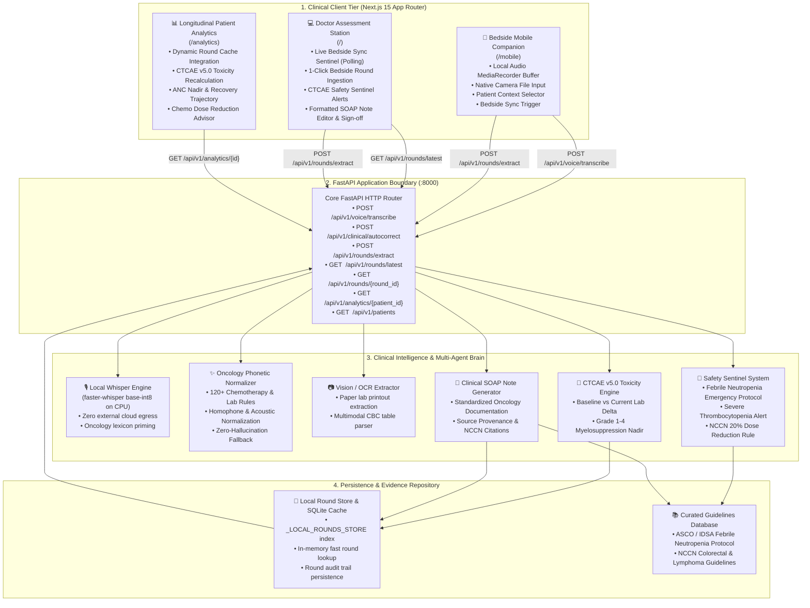

# 🏛️ RoundsAI System Architecture

RoundsAI is architected around a privacy-first, multimodal clinical workflow designed for inpatient oncology wards.

---

## 1. High-Level Architectural Flow

---

## 2. Component Breakdown

### A. Bedside Mobile Companion (`/mobile`)
- Optimized for mobile handheld devices at the patient bedside.
- Captures audio via HTML5 `MediaRecorder` or native Web Speech API.
- Captures paper lab sheets, pathology reports, and vital monitors using device camera.
- Transmits complete payload (`patient_id`, `transcript`, `images`) to backend with 1-tap confirmation feedback.

### B. Doctor Assessment Station (`/`)
- Desktop workstation for attending oncologists.
- Features a **live background sentinel** checking for transmitted bedside rounds every 8 seconds.
- Displays a prominent alert banner with 1-click **"Load into Assessment Station"** action.
- Directly populates bedside findings, CTCAE evaluation flags, and drafts the clinical SOAP note.

### C. On-Device Speech Pipeline (`faster-whisper`)
- Zero external API costs and 100% HIPAA/hospital network privacy.
- Uses `faster-whisper` base-int8 model quantized for sub-second CPU inference.
- Employs an oncology-specific vocabulary prompt (`initial_prompt`) to prime the acoustic model on drug regimens (`mFOLFOX6`, `FOLFIRINOX`, `R-CHOP`, `ANC`, `Platelets`, `CTCAE`).

### D. Clinical Phonetic Normalizer (`backend/services/clinical_autocorrect.py`)
- Standardizes over 120 specialized oncology terms, laboratory metrics, and chemotherapy protocols.
- Fixes phonetic homophones (e.g., *"fall fox"* $\rightarrow$ **mFOLFOX6**, *"carbo taxol"* $\rightarrow$ **Carboplatin + Paclitaxel**).
- Fallback to Gemini 2.5 Flash at `temperature=0.0` with strict zero-hallucination prompting.
- Clinician UI displays a 1-click **Undo** banner for full clinician oversight.

### E. Automated CTCAE v5.0 & Clinical Safety Sentinels
- Compares extracted laboratory metrics against patient baseline values.
- Evaluates Grade 1–4 toxicities according to the Common Terminology Criteria for Adverse Events (CTCAE v5.0):
  - **Grade 3 Neutropenia**: $500 \le \text{ANC} < 1000$ /µL
  - **Grade 4 Severe Neutropenia**: $\text{ANC} < 500$ /µL
- **Emergency Sentinel**: Flags **Febrile Neutropenia** when fever ($\ge 38.3^\circ\text{C}$ or sustained $\ge 38.0^\circ\text{C}$) coincides with $\text{ANC} < 1000$ /µL. Urgently recommends blood cultures and empiric antipseudomonal IV beta-lactams (*Cefepime 2g IV q8h*) within 60 minutes.

### F. Longitudinal Patient Analytics (`/analytics`)
- Aggregates rounds from in-memory cache (`_LOCAL_ROUNDS_STORE`) and database.
- Plots cycle-over-cycle laboratory trends for ANC, WBC, and Platelets.
- Recommends NCCN guideline-concordant dose modifications (e.g., 20% dose reduction for subsequent cycles upon Grade 3/4 nadir).
